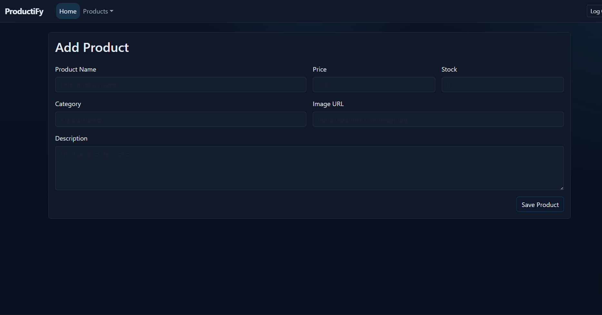
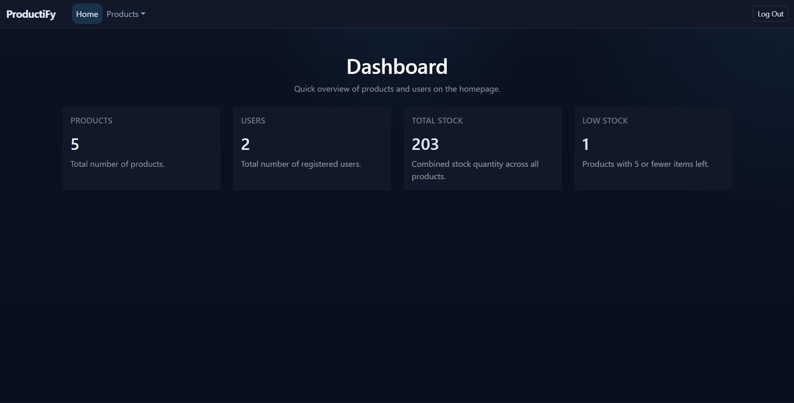
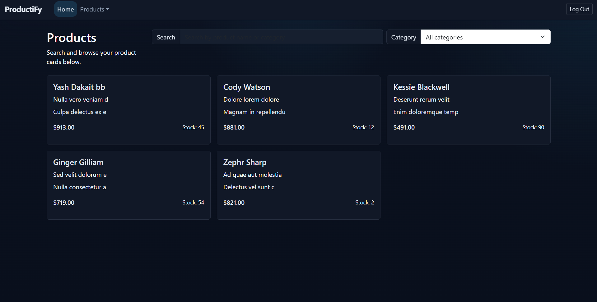
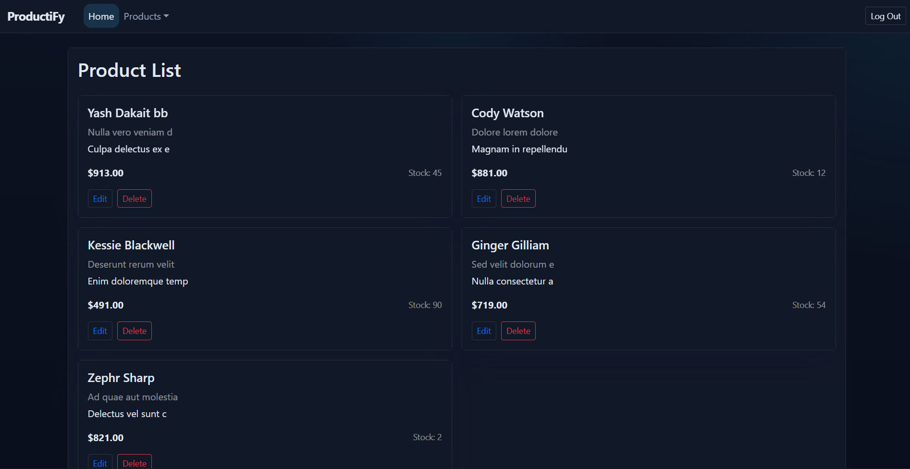

# ProductiFy — React Product Management Dashboard

A responsive React single-page application for managing products and users with authentication, dashboard metrics, and CRUD operations.

## Project Overview

ProductiFy is a small-scale admin dashboard built with React, Redux, React Router, and Bootstrap. It provides the following core capabilities:

- User authentication flow with Sign In and Sign Up screens.
- Dashboard homepage with live statistics and counters.
- Product creation and editing using a reusable form.
- Product list view with delete actions.
- Product item browsing with search and category filtering.
- Local JSON server backend for product and user data storage.

## User Interface

The UI uses Bootstrap for modern layout styling and responsive cards. Key screens include:

- `Home` dashboard with summary counters for total products, total users, overall stock, and low stock items.
- `Product Form` for adding and updating product details.
- `Product List` for viewing all saved products and performing delete/edit actions.
- `Product Items` for searching and filtering product cards by name or category.
- `Navbar` with navigation links for Home, Product Form, Product List, Product Items, and logout.

## Tech Stack

- React 19
- React Router DOM 7
- Redux Toolkit
- React Redux
- Axios
- Bootstrap 5
- Vite
- JSON Server
- ESLint

## Folder Structure

- `src/components/` – React components for pages and UI.
- `src/features/` – Redux slices for products and users.
- `src/api/instance.js` – Axios base instance for API requests.
- `src/app/store.js` – Redux store configuration.
- `db.json` – Local JSON Server database.

## Setup and Run

1. Install dependencies:

```bash
npm install
```

2. Start the JSON server backend:

```bash
npx json-server --watch db.json --port 3000
```

3. Start the React application:

```bash
npm run dev
```

4. Open the local URL shown in the terminal (typically `http://localhost:5173`).

## Notes

- The app expects the API base URL to be `http://localhost:3000`.
- Authentication is handled by storing a token in `localStorage`.
- The dashboard loads product and user counts from Redux state.

## Improvements

Potential next steps include:

- Adding real backend authentication.
- Showing success/error toast notifications.
- Improving form validation and error handling.
- Adding pagination for product lists.

---

## Screenshots








